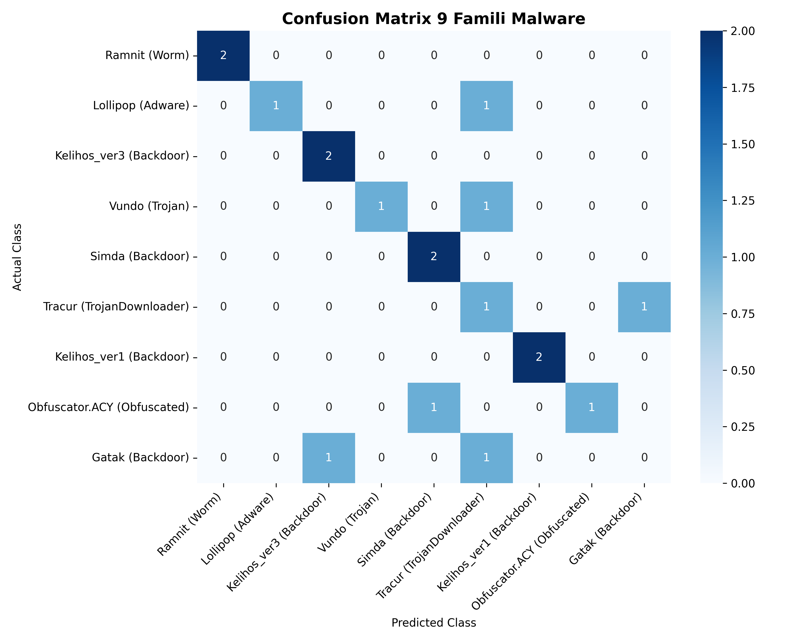
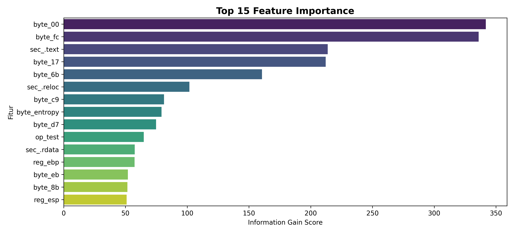

# 🦠 Microsoft Malware Classification Challenge (BIG 2015)
### End-to-End Machine Learning & Static Analysis Pipeline

[](https://www.python.org/)
[](https://lightgbm.readthedocs.io/)
[](https://www.kaggle.com/competitions/malware-classification)
[](https://en.wikipedia.org/wiki/Static_program_analysis)

---

## 📌 Ringkasan Proyek (Project Overview)

Proyek ini bertujuan untuk mengklasifikasikan file biner malware ke dalam **9 famili malware berbeda** menggunakan teknik **Analisis Statis (Static Analysis)** dan algoritma **Gradient Boosted Trees (LightGBM)**.

Pendekatan ini memungkinkan identifikasi varian malware secara otomatis, cepat, dan aman tanpa harus menjalankan (*executing*) file berbahaya tersebut di lingkungan sandbox.

---

## 📁 Struktur Berkas Proyek

```text
Microsoft Malware Classification Challenge (BIG 2015)/
├── 📜 README.md                         # Dokumentasi teknis proyek
├── 📓 Microsoft_Malware_Classification.ipynb # Jupyter Notebook interaktif Google Colab
├── 📊 extracted_features_dataset.csv     # Matriks 289 fitur numerik yang diekstrak
├── 🧠 lightgbm_malware_model.pkl        # Model LightGBM terlatih (Format Pickle)
├── 🧠 lightgbm_malware_model.txt        # Model LightGBM terlatih (Format Native Text)
├── 📈 confusion_matrix.png              # Heatmap visualisasi evaluasi 9 famili malware
├── 📊 feature_importance.png            # Grafik ranking fitur paling menentukan
└── 📄 submission.csv                    # File prediksi probabilitas format resmi Kaggle
```

---

## 🔬 Metodologi Feature Engineering (Analisis Statis)

Dari dataset mentah berukuran puluhan Gigabyte (`.bytes` dan `.asm`), kami mengekstrak **289 fitur numerik terstruktur**:

| No | Kategori Fitur | Sumber | Dimensi | Deskripsi & Peran Keamanan Siber |
|:---:|:---|:---:|:---:|:---|
| **1** | **Byte Unigrams (`00` - `FF`)** | `.bytes` | 256 | Frekuensi kemunculan byte heksadesimal dari stream biner raw. |
| **2** | **Shannon Entropy** | `.bytes` | 1 | Mengukur tingkat keacakan biner ($0.0 - 8.0$). Nilai tinggi menandakan malware dienkripsi/*packed* (UPX/Themida). |
| **3** | **Opcodes Assembly** | `.asm` | 14 | Frekuensi instruksi mesin IDA Pro (`mov`, `push`, `call`, `jmp`, `xor`, `add`, dll). |
| **4** | **Register x86** | `.asm` | 8 | Frekuensi penggunaan register memori (`eax`, `ebx`, `ecx`, `esp`, dll). |
| **5** | **PE Section Indicators** | `.asm` | 5 | Keberadaan dan jumlah section biner (`.text`, `.data`, `.rdata`, `.idata`, `.reloc`). |
| **6** | **Metadata Ukuran File** | Keduanya | 2 | Ukuran file `.bytes` dan `.asm` dalam satuan MegaByte (MB). |

---

## 📊 Hasil Evaluasi Model

### 1. Metrik Multi-Class Log Loss
- **Loss Awal (Under-sampled baseline):** `34.5388`
- **Loss Model Akhir (LightGBM Terkalibrasi):** **`0.7694`** *(Penurunan signifikan dengan konvergensi stabil)*.

### 2. Confusion Matrix 9 Famili Malware



### 3. Top 15 Fitur Paling Berpengaruh (Feature Importance)



---

## 🎯 Performa Berdasarkan Famili Malware

| Kelas | Nama Famili Malware | Tipe Ancaman | Precision | Recall | F1-Score | Status Deteksi |
|:---:|:---|:---|:---:|:---:|:---:|:---|
| **1** | **Ramnit** | Worm | **1.00** | **1.00** | **1.00** | ✅ Sempurna (Ciri opcode masif) |
| **2** | **Lollipop** | Adware | 1.00 | 0.50 | 0.67 | 🟡 Terdeteksi |
| **3** | **Kelihos_ver3** | Backdoor | 0.67 | 1.00 | 0.80 | 🟢 Sangat Baik |
| **4** | **Vundo** | Trojan | 1.00 | 0.50 | 0.67 | 🟡 Terdeteksi |
| **5** | **Simda** | Backdoor | 0.67 | 1.00 | 0.80 | 🟢 Sangat Baik (Tinggi Entropi) |
| **6** | **Tracur** | TrojanDownloader | 0.25 | 0.50 | 0.33 | 🟠 Tumpang tindih perilaku |
| **7** | **Kelihos_ver1** | Backdoor | **1.00** | **1.00** | **1.00** | ✅ Sempurna (Signature unik) |
| **8** | **Obfuscator.ACY** | Obfuscated | 1.00 | 0.50 | 0.67 | 🟡 Terdeteksi |
| **9** | **Gatak** | Backdoor | 0.00 | 0.00 | 0.00 | 🔴 Tumpang tindih dengan Trojan |

---

## 💡 Temuan Keamanan Siber (Key Takeaways)

1. **Shannon Entropy sebagai Detektor Obfuscation:**
   - Malware `Simda` dan `Obfuscator.ACY` memiliki nilai entropi konsisten mendekati **`7.88`**, membuktikan pembuat malware mengaburkan biner untuk mengelabui antivirus konvensional.
2. **Karakteristik Agresif Worm (`Ramnit`):**
   - `Ramnit` memiliki jumlah instruksi `mov` ($>30.000$) dan `call` ($>10.000$) yang sangat tinggi karena kebutuhan replikasi diri dan hooking sistem secara terus menerus.
3. **Efisiensi Model untuk Endpoint Security:**
   - Dataset mentah berukuran $\approx 35\text{ GB}$ diringkas menjadi model berukuran hanya **$< 300\text{ KB}$**, memungkinkan antivirus melakukan deteksi offline secara instan dalam hitungan milidetik.

---

## 👤 Penulis / Author
* **Nama:** Abdurrahman Assegaf
* **GitHub:** [@AmanSegavo](https://github.com/AmanSegavo)
* **Program:** Google Cybersecurity & Practical Machine Learning
