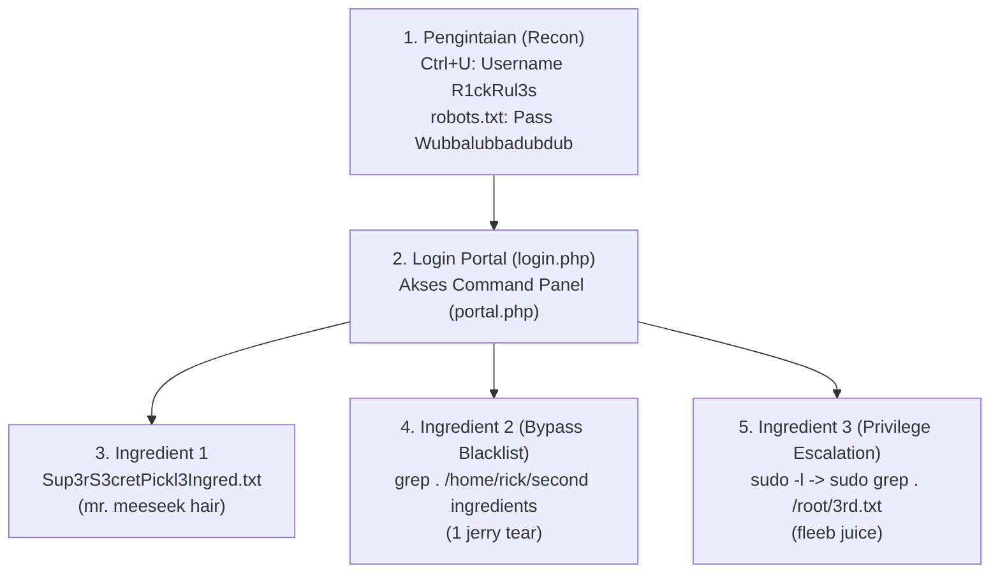

# 🥒 TryHackMe: Pickle Rick (Command Injection & Privilege Escalation)
### Laporan Praktik Keamanan Siber & CTF (Hands-on Writeup)

[](https://tryhackme.com/room/picklerick)
[](https://owasp.org/www-community/attacks/Command_Injection)
[](https://owasp.org/Top10/A03_2021-Injection/)
[](#)

---

## 📌 Ringkasan Laboratorium (Lab Overview)

* **Platform:** [TryHackMe](https://tryhackme.com/)
* **Room Name:** [Pickle Rick](https://tryhackme.com/room/picklerick)
* **Kategori:** Web Application Security / Linux Privilege Escalation
* **Konsep Inti:** Information Disclosure, Web-based Command Panel, Command Blacklisting Bypass, Sudo Misconfiguration Privilege Escalation.
* **Tautan Penyelesaian Resmi:** [TryHackMe Room Completed](https://tryhackme.com/room/picklerick?utm_campaign=social_share&utm_medium=social&utm_content=room&utm_source=copy&sharerId=6a7a39dc5261433f512fc695)

---

## 🎯 Skenario CTF (Scenario)

Rick telah mengubah dirinya kembali menjadi acar (*Pickle Rick*), namun lupa kata sandi komputernya. Sebagai Morty, praktikan ditugaskan untuk masuk ke portal sistem Rick dan menemukan **tiga bahan rahasia (*three secret ingredients*)** yang tersebar di sistem file Linux untuk menyelesaikan ramuan pengembalian wujud (*pickle-reverse potion*).

---

## 🛠️ Alur Eksploitasi Teknis (End-to-End Walkthrough)



---

### Fase 1: Pengintaian & Penemuan Kredensial (*Reconnaissance*)

1. **Pemeriksaan Kode Sumber (`Ctrl + U`):**
   Pada halaman beranda `http://10.49.190.254/`, ditemukan komentar HTML yang membocorkan nama pengguna:
   ```html
   <!--
     Note to self, remember username!
     Username: R1ckRul3s
   -->
   ```

2. **Pemeriksaan `robots.txt`:**
   Mengakses `http://10.49.190.254/robots.txt` menghasilkan teks satu baris:
   ```text
   Wubbalubbadubdub
   ```
   **Hasil Kredensial:** `R1ckRul3s` : `Wubbalubbadubdub`

---

### Fase 2: Autentikasi ke Portal Perintah (*Command Panel Access*)

1. Mengakses portal login di `http://10.49.190.254/login.php` dan memasukkan kredensial yang ditemukan.
2. Sistem berhasil mengalihkan ke halaman **`portal.php`**, yang menyediakan antarmuka web interaktif untuk mengeksekusi perintah shell Linux di server (*Web Shell / Command Panel*).

---

### Fase 3: Penemuan Bahan Rahasia ke-1 (Ingredient 1)

1. Menjalankan perintah daftar berkas di Command Panel:
   ```bash
   ls -la
   ```
2. Ditemukan file berekstensi teks di direktori web root (`/var/www/html/`):
   - `Sup3rS3cretPickl3Ingred.txt`
   - `clue.txt` (Berisi petunjuk: *"Look around the file system for the other ingredient."*)
3. Mengakses file bahan pertama langsung melalui web:
   `http://10.49.190.254/Sup3rS3cretPickl3Ingred.txt`

> **🚩 Bahan ke-1 (Ingredient 1):** `mr. meeseek hair`

---

### Fase 4: Penemuan Bahan Rahasia ke-2 (Bypass Filter Perintah)

1. Melakukan eksplorasi direktori pengguna Linux:
   ```bash
   ls -la /home/rick
   ```
   Ditemukan file bernama: `second ingredients`.
2. Saat mencoba membaca file dengan perintah standar `cat` atau `head`, server memicu mekanisme pertahanan blacklist:
   > *"Command disabled to make it hard for future PICKLEEEE RICCCKKKK."*
3. **Teknik Bypass:** Menggunakan utilitas alternatif Linux seperti `grep`, `tac`, `less`, atau `base64`:
   ```bash
   grep . "/home/rick/second ingredients"
   ```

> **🚩 Bahan ke-2 (Ingredient 2):** `1 jerry tear`

---

### Fase 5: Penemuan Bahan Rahasia ke-3 (Linux Privilege Escalation)

1. Memeriksa konfigurasi izin hak istimewa pengguna web server (`www-data`):
   ```bash
   sudo -l
   ```
   **Hasil:**
   ```text
   User www-data may run the following commands on ip-10-49-190-254:
       (ALL) NOPASSWD: ALL
   ```
   *(Pengguna `www-data` memiliki izin eksekusi seluruh perintah sebagai superuser `root` tanpa memerlukan kata sandi).*

2. Mengeksplorasi direktori root sistem (`/root`):
   ```bash
   sudo ls -la /root
   ```
   Ditemukan file `3rd.txt`.

3. Membaca konten file root:
   ```bash
   sudo grep . /root/3rd.txt
   ```

> **🚩 Bahan ke-3 (Ingredient 3):** `fleeb juice`

---

## 🏆 Kunci Jawaban Lengkap (Flags Table)

| Pertanyaan / Task | Deskripsi Target | Kunci Jawaban (*Flag*) |
|:---|:---|:---|
| **Question 1** | *What is the first ingredient Rick needs?* | **`mr. meeseek hair`** |
| **Question 2** | *What is the second ingredient in Rick's potion?* | **`1 jerry tear`** |
| **Question 3** | *What is the final ingredient Rick needs?* | **`fleeb juice`** |

---

## 🔬 Analisis Keamanan & Remediasi (Security Analysis & Defense)

### 1. Information Disclosure pada Komentar & `robots.txt`
* **Kerentanan:** Menyimpan kredensial administratif pada komentar HTML publik dan file robot perayap mesin pencari.
* **Remediasi:** Hilangkan seluruh komentar pengembang dari file *production* dan jangan pernah menempatkan kata sandi pada artefak publik.

### 2. Remote Command Execution & Flawed Blacklisting
* **Kerentanan:** Menggunakan *blacklist filter* (memblokir `cat`/`head`) alih-alih validasi ketat (*whitelist*). Penyerang dapat dengan mudah melakukan bypass menggunakan puluhan binary bawaan Linux lainnya (`tac`, `nl`, `sed`, `awk`, `grep`, `od`, `strings`).
* **Remediasi:** Hindari mengeksekusi input pengguna secara langsung ke dalam fungsi shell sistem (seperti `shell_exec` atau `system` di PHP). Gunakan API terprogram atau sanitasi ketat.

### 3. Misfortune Sudoers Configuration (`NOPASSWD: ALL`)
* **Kerentanan:** Pengguna akun layanan web (`www-data`) diberikan hak sudo universal tanpa otentikasi. Jika layanan web ditembus, penyerang otomatis menguasai sistem secara penuh (*Full Root Compromise*).
* **Remediasi:** Terapkan **Prinsip Hak Istimewa Terendah (*Principle of Least Privilege*)**. Akun `www-data` seharusnya tidak memiliki entri sudoers apa pun.

---

## 👤 Profil Penulis
* **Praktikan:** Abdurrahman Assegaf
* **TryHackMe Profile:** [amanshop328](https://tryhackme.com/p/amanshop328)
* **GitHub:** [@AmanSegavo](https://github.com/AmanSegavo)
* **Program:** Google Cybersecurity & Practical Penetration Testing
