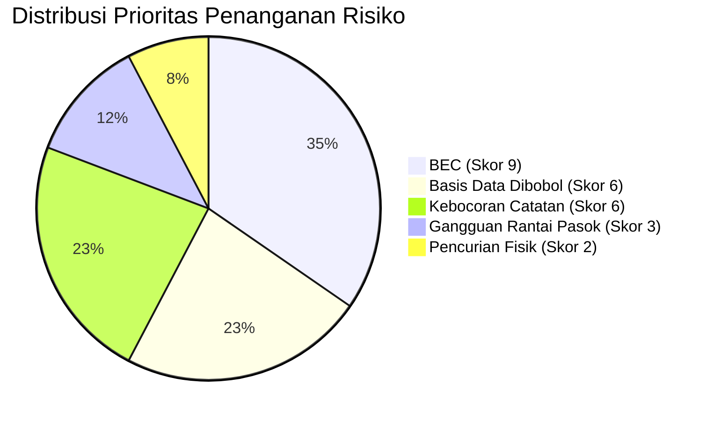

# Aktivitas Portofolio: Melakukan Penilaian Risiko (Risk Assessment) & Daftar Risiko (Risk Register)

**Program:** Google Cybersecurity Professional Certificate  
**Modul:** Play It Safe: Manage Security Risks (Course 2)  
**Studi Kasus:** Penilaian Risiko Operasional & Perlindungan Dana pada Bank Komersial  

---

## 1. Ringkasan Eksekutif & Karakteristik Lingkungan Operasional

Bank komersial beroperasi di daerah pesisir dengan tingkat kejahatan lokal yang rendah. Namun, bank menghadapi profil risiko yang kompleks karena mengelola aset berharga tinggi (**dana bank**) dan harus mematuhi regulasi keuangan yang sangat ketat (seperti kepatuhan cadangan kas harian *Federal Reserve*).

### Parameter Lingkungan Operasional:
- **Tenaga Kerja:** 100 karyawan di lokasi (*on-site*) dan 20 karyawan jarak jauh (*remote*).
- **Basis Nasabah:** 2.000 rekening nasabah individu dan 200 rekening komersial.
- **Kemitraan Komunitas:** Dipasarkan oleh 1 tim olahraga profesional dan 10 bisnis lokal.
- **Kepatuhan Regulasi:** Wajib menjaga ketersediaan dana likuid harian dan mengamankan privasi data keuangan nasabah.
- **Kondisi Geografis:** Terletak di wilayah pesisir yang rentan terhadap potensi cuaca ekstrem / badai berkala.

---

## 2. Catatan Penjelasan Faktor Risiko (Risk Factors Explanation)

> **Catatan (40-60 Kata):**  
> *"Peristiwa keamanan dapat terjadi ketika penyerang mengeksploitasi 20 karyawan jarak jauh melalui rekayasa sosial seperti pembobolan email bisnis untuk memanipulasi pengalihan dana bank. Selain itu, gangguan rantai pasokan akibat cuaca buruk di wilayah pesisir dapat menghambat pasokan uang tunai harian, sehingga mengancam kepatuhan bank terhadap regulasi cadangan kas Federal Reserve."* (51 kata)

---

## 3. Matriks & Formula Penilaian Risiko (Risk Scoring Matrix)

Sesuai dengan panduan **NIST Cybersecurity Framework (CSF)**, skor risiko dihitung menggunakan formula:

$$\text{Risiko (Prioritas)} = \text{Kemungkinan (Likelihood)} \times \text{Tingkat Keparahan (Severity/Impact)}$$

### Skala Penilaian:
- **Kemungkinan (Likelihood):** `1` = Rendah (jarang terjadi) | `2` = Sedang | `3` = Tinggi (sering menjadi target).
- **Tingkat Keparahan (Severity):** `1` = Dampak Rendah | `2` = Dampak Sedang | `3` = Dampak Kritis (finansial/regulasi).
- **Skor Prioritas Risiko:** Skala `1` sampai `9` (Semakin tinggi skor, semakin mendesak untuk dimitigasi).

---

## 4. Daftar Risiko Lengkap (Risk Register Table)

Berikut adalah hasil evaluasi 5 risiko utama terhadap dana dan operasional bank:

| No | Risiko Keamanan (*Risk*) | Deskripsi Risiko (*Description*) | Kemungkinan (*Likelihood: 1-3*) | Tingkat Keparahan (*Severity: 1-3*) | Skor Prioritas (*Priority: 1-9*) | Tingkat Urgensi |
|:---:|:---|:---|:---:|:---:|:---:|:---:|
| **1** | **Pembobolan Email Bisnis (*Business Email Compromise - BEC*)** | Penyerang menyamar sebagai eksekutif atau vendor terpercaya melalui email phishing untuk mengelabui karyawan agar mentransfer dana bank ke rekening penyerang. Adanya 20 karyawan remote meningkatkan kerentanan ini. | **3** *(Tinggi)* | **3** *(Tinggi)* | **9** | 🔴 **Kritis (Paling Utama)** |
| **2** | **Basis Data Pengguna Dibobol (*Compromised User Database*)** | Penyerang menembus server database yang menyimpan 2.200 akun nasabah, mencuri kredensial perbankan, dan melakukan penarikan dana tanpa otorisasi. | **2** *(Sedang)* | **3** *(Tinggi)* | **6** | 🟠 **Tinggi** |
| **3** | **Kebocoran Catatan Keuangan (*Financial Records Leak*)** | Dokumen dan pembukuan internal keuangan bank bocor ke publik atau pihak ketiga, menyebabkan sanksi berat dari regulator dan hilangnya reputasi bisnis. | **2** *(Sedang)* | **3** *(Tinggi)* | **6** | 🟠 **Tinggi** |
| **4** | **Pencurian Fisik (*Theft / Physical Robbery*)** | Pencurian uang tunai fisik secara langsung di lokasi kantor bank. Karena lokasi berada di wilayah pesisir dengan tingkat kejahatan rendah, kemungkinan insiden ini relatif kecil. | **1** *(Rendah)* | **2** *(Sedang)* | **2** | 🟢 **Rendah** |
| **5** | **Serangan / Gangguan Rantai Pasokan (*Supply Chain Disruption*)** | Gangguan pada vendor pihak ketiga atau vendor logistik pengantar uang tunai (misalnya akibat badai pesisir) yang menyebabkan bank gagal memenuhi kuota kas harian Federal Reserve. | **1** *(Rendah)* | **3** *(Tinggi)* | **3** | 🟡 **Sedang** |

---

## 5. Analisis Prioritas & Rekomendasi Mitigasi (NIST CSF)

Berdasarkan skor prioritas pada *Risk Register*, tim keamanan siber memprioritaskan alokasi sumber daya sebagai berikut:

### Rekomendasi Tindakan Keamanan:

1. **Prioritas 1 — Mitigasi BEC (Skor 9):**
   - Terapkan **Multi-Factor Authentication (MFA)** wajib untuk seluruh akun email karyawan (terutama 20 staf jarak jauh).
   - Buat SOP otorisasi ganda (*dual-authorization*) via panggilan suara/video sebelum melakukan transfer dana bernilai besar.
   - Pelatihan simulasi anti-phishing berkala bagi staf.

2. **Prioritas 2 — Proteksi Basis Data & Catatan Keuangan (Skor 6):**
   - Terapkan enkripsi menyeluruh (*AES-256*) pada data saat disimpan (*at-rest*) dan saat dikirimkan (*in-transit*).
   - Terapkan kontrol akses berbasis peran (*Role-Based Access Control - RBAC*) dengan prinsip *Least Privilege*.

3. **Prioritas 3 — Rantai Pasokan & Kepatuhan Regulasi (Skor 3):**
   - Buat perjanjian *Service Level Agreement (SLA)* dengan vendor cadangan dan susun rencana kontinjensi cuaca ekstrem untuk menjamin pasokan kas harian *Federal Reserve*.

4. **Prioritas 4 — Keamanan Fisik (Skor 2):**
   - Pertahankan prosedur penguncian fisik, kamera CCTV, dan brankas standar perbankan yang sudah berjalan.

---

## 👤 Profil Penulis
* **Nama:** Abdurrahman Assegaf
* **Program:** Google Cybersecurity Professional Certificate
* **GitHub:** [@AmanSegavo](https://github.com/AmanSegavo)
