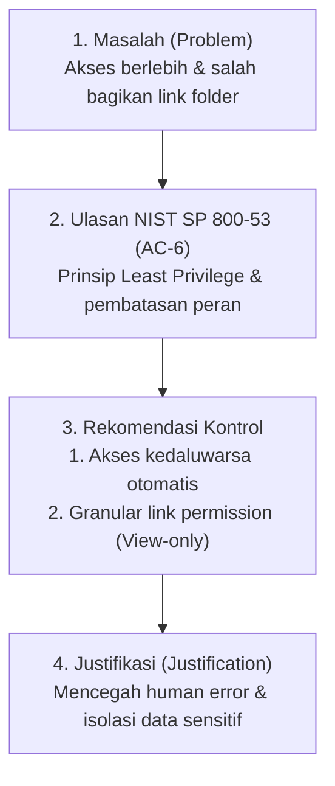

# Aktivitas Portofolio: Menganalisis Kebocoran Data & Penerapan Prinsip Least Privilege (NIST SP 800-53: AC-6)

**Program:** Google Cybersecurity Professional Certificate  
**Modul:** Assets, Threats, and Vulnerabilities (Course 5)  
**Studi Kasus:** Investigasi Kebocoran Dokumen Rencana Bisnis Internal pada Perusahaan EdTech  

---

## 1. Ringkasan Insiden & Konteks Organisasi

Sebuah perusahaan teknologi pendidikan (*EdTech*) yang mengembangkan aplikasi penilaian tugas otomatis menangani data sensitif dari sekolah, guru, orang tua, dan murid. 

Terjadi insiden keamanan di mana **dokumen rencana bisnis internal dan analisis pelanggan bocor di media sosial**. Investigasi awal menemukan bahwa insiden ini dipicu oleh pelanggaran prinsip hak istimewa terendah (*Least Privilege*) dan kelalaian pembagian tautan (*link sharing*) dokumen cloud saat rapat penjualan dengan mitra bisnis eksternal berlangsung.

---

## 2. Lembar Kerja Kebocoran Data (Data Leak Worksheet)

Berikut adalah ringkasan analisis 4 elemen kunci sesuai standar kurikulum resmi Google Cybersecurity:

---

### A. Masalah (*Problem Analysis*)
*(Kriteria: 20–60 kata, 2–3 kalimat)*

> **Analisis Masalah:**  
> *"Insiden kebocoran data terjadi karena manajer gagal mencabut hak akses folder internal setelah pekerjaan selesai, melanggar prinsip least privilege. Selain itu, perwakilan customer success tidak sengaja membagikan tautan seluruh folder rahasia alih-alih satu file materi pemasaran kepada mitra eksternal, yang kemudian mengunggahnya ke media sosial."* **(46 kata)**

---

### B. Ulasan NIST SP 800-53: AC-6 (*Review*)
*(Kriteria: 20–60 kata, 2–3 kalimat)*

> **Ringkasan Kontrol:**  
> *"NIST SP 800-53 Kontrol AC-6 menetapkan prinsip hak istimewa terendah (least privilege) dengan hanya memberikan hak akses minimum yang diperlukan pengguna untuk menjalankan tugas resminya. Kontrol ini mencakup pembatasan akses fungsi non-hak istimewa (AC-6(1)), peninjauan akun berkala (AC-6(7)), dan pencabutan hak akses otomatis saat tidak lagi dibutuhkan."* **(50 kata)**

---

### C. Rekomendasi Peningkatan Kontrol (*Recommendations*)
*(Kriteria: 2 rekomendasi peningkatan kontrol berbasis NIST AC-6)*

1. **Penerapan Hak Akses Berbatas Waktu & Pencabutan Otomatis (*Time-based Expiration & Automated Revocation - AC-6(7)*):**  
   - Mengonfigurasi izin berbagi dokumen/folder pada platform penyimpanan cloud (*Google Drive / OneDrive / SharePoint*) agar memiliki masa berlaku sementara (misal: otomatis kedaluwarsa dalam 24 jam setelah rapat selesai).
   - Menerapkan audit akses berkala (*periodic access review*) untuk meninjau dan menghapus izin folder yang tidak lagi aktif.

2. **Pembatasan Izin Tautan Eksternal & Kontrol Granular (*Granular Link Permission & DLP - AC-6(1) / AC-6(2)*):**  
   - Menonaktifkan opsi pembagian tautan tingkat folder untuk pengguna eksternal (*disable folder-level sharing to external domains*).
   - Membatasi akses pihak luar hanya pada tingkat berkas individual (*file-level only*) dengan hak akses **Hanya Lihat (*View-Only / Restricted*)**, serta memblokir opsi unduh (*download*), cetak (*print*), dan salin (*copy*).

---

### D. Justifikasi Rekomendasi (*Justification*)
*(Kriteria: 20–60 kata, 2–3 kalimat)*

> **Justifikasi:**  
> *"Peningkatan kontrol ini akan mencegah kesalahan manusia (human error) dengan memastikan akses sensitif dicabut secara otomatis ketika tugas selesai. Selain itu, pembatasan izin berbagi ke pihak eksternal memastikan karyawan tidak dapat membagikan seluruh folder rahasia secara tidak sengaja, sehingga menjaga kerahasiaan dan privasi data perusahaan."* **(46 kata)**

---

## 3. Matriks Perbandingan Kontrol Keamanan (Sebelum vs Sesudah)

| Parameter Kontrol | Kondisi Saat Insiden (Sebelum) | Kondisi Rekomendasi Baru (Sesudah) | Standar NIST SP 800-53 |
| :--- | :--- | :--- | :---: |
| **Cakupan Akses Folder** | Folder penuh dibagikan tanpa batas waktu | Akses per-file individual dengan batas kedaluwarsa otomatis | **AC-6(7)** |
| **Izin Pihak Eksternal** | Mitra eksternal dapat melihat seluruh isi folder | Akses *View-Only* dengan proteksi *watermark* dan anti-download | **AC-6(2)** |
| **Pencabutan Izin (*Revocation*)** | Manual (sering terlupa oleh manajer) | Otomatis via kebijakan sistem penyimpanan cloud (*Automated Policy*) | **AC-6** |
| **Pencegahan Kebocoran Data** | Tidak ada kontrol DLP (*Data Loss Prevention*) | Penerapan label klasifikasi dokumen (*Confidential / Internal Only*) | **AC-6(1)** |

---

## 👤 Profil Penulis
* **Nama:** Abdurrahman Assegaf
* **Program:** Google Cybersecurity Professional Certificate
* **GitHub:** [@AmanSegavo](https://github.com/AmanSegavo)
